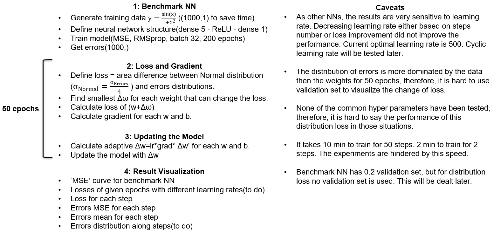
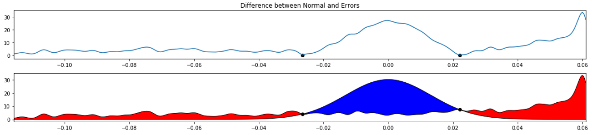
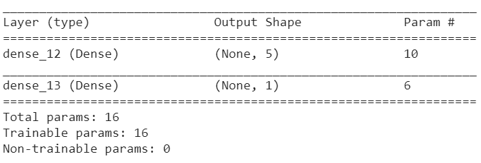
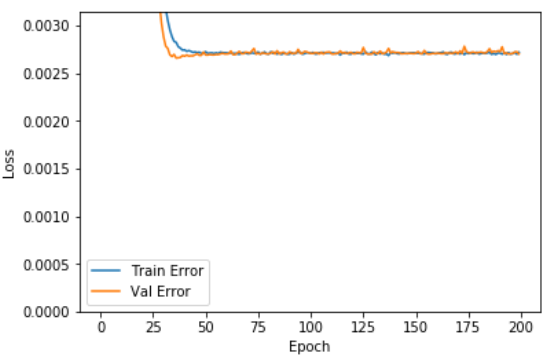
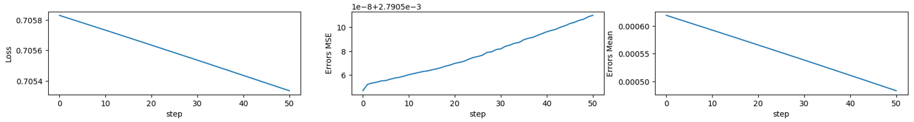
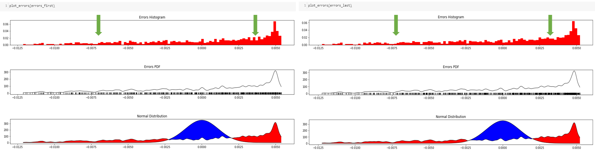
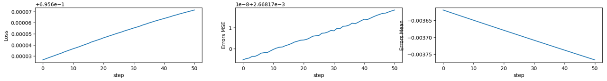
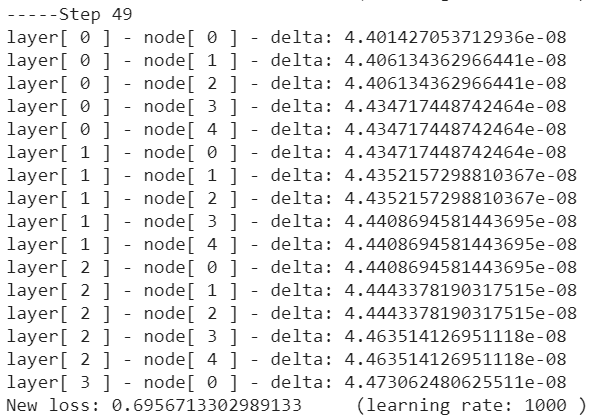
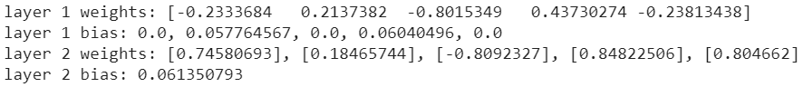
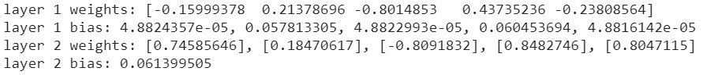

## Project overview:

An example for the meaning of distribution loss:

Benchmark NN structure:

MSE along training for benchmark NN:

## Priliminary Results:

 With learning rate = 100, epochs = 50:
 

The change of errors distribution is very subtle after 50 epochs:

When learning rate(1000) is too large, the model diverges:

PS: learning rate here did not include the adaptive part for each weight, an example of actual weight change with learning rate = 1000:

An example of weights trained with distribution loss:

before

after

*This is a 2019 summer intern project under Dr.Hong Wang in NTRC.*

