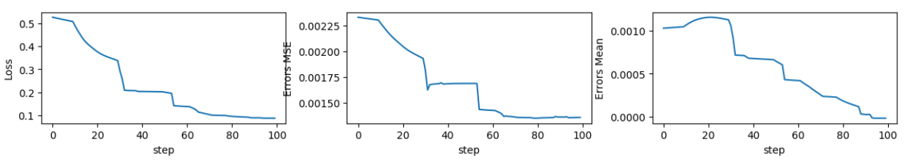
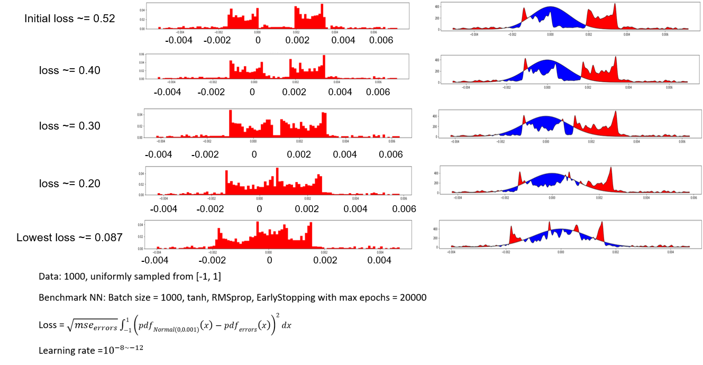

## Project overview:

An example for the meaning of distribution loss:

Benchmark NN structure:

MSE along training for benchmark NN:

 ---

## Priliminary Results:
 

The change of errors distribution is very subtle after 50 epochs:

When learning rate(1000) is too large, the model diverges:

PS: learning rate here did not include the adaptive part for each weight, an example of actual weight change with learning rate = 1000:

An example of weights trained with distribution loss:

before

after

*This is a 2019 summer intern project under Dr.Hong Wang in NTRC.*

Issues:

tf.keras.optimizers.SGD 

=> tf.train.Optimizer 

=> tf.train.Optimizer.compute_gradients 

=> tf.python.eager.backprop.GradientTape().gradient() 

=> tensorflow.python.eager.imperative_grad.imperative_grad() 

=>tensorflow.python.pywrap_tensorflow.TFE_Py_TapeGradient() 

=> There is no "TFE_Py_TapeGradient()" in "pywrap_tensorflow"

=>https://github.com/tensorflow/tensorflow/issues/29064
